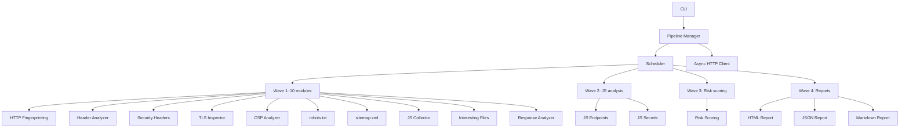

# ReconForgeX

**Async-first reconnaissance framework in pure Python. No external tool dependencies.**

[](https://github.com/NASHEDIxCODER/reconforgex/actions/workflows/ci.yml)
[](https://www.python.org/downloads/)
[](https://opensource.org/licenses/MIT)
[](https://github.com/psf/black)
[](https://github.com/astral-sh/ruff)

---

## What is ReconForgeX?

ReconForgeX is a Python framework for HTTP-based security reconnaissance. It runs 13 analysis modules against a target domain to discover technologies, security issues, exposed files, JavaScript secrets, and more.

**Key characteristic**: Every module is implemented in pure Python. There are no wrappers around external tools like nmap, nuclei, subfinder, or httpx. The only runtime dependencies are `httpx` (HTTP client) and `pyyaml` (config parsing).

## Why does it exist?

Existing reconnaissance tools typically shell out to external binaries. This creates:

- **Dependency hell**: Each tool requires its own runtime, version, and configuration
- **Inconsistent behavior**: Different environments produce different results
- **CI/CD friction**: Installing 5+ external tools in a pipeline is error-prone

ReconForgeX solves this by implementing everything in Python. One `pip install` gives you a complete reconnaissance framework.

## Who is it for?

- **Security engineers** who need a reliable, reproducible reconnaissance tool
- **Penetration testers** who want to automate initial reconnaissance
- **DevSecOps teams** integrating security scanning into CI/CD pipelines
- **Python developers** who want to understand or extend reconnaissance logic

## How does it work?



1. **CLI** parses arguments and loads configuration
2. **Pipeline Manager** creates a shared HTTP client and registers all modules
3. **Scheduler** computes execution order using dependency resolution (Kahn's algorithm)
4. **Modules** run in waves — independent modules run concurrently, dependent modules wait
5. **Reports** are generated from accumulated results

## Architecture

## Installation

```bash
# Clone the repository
git clone https://github.com/NASHEDIxCODER/reconforgex.git
cd reconforgex

# Install dependencies
pip install -e .

# Optional: monitoring capabilities (memory/CPU tracking)
pip install -e ".[monitoring]"

# Optional: all extras (dev + monitoring)
pip install -e ".[all]"
```

## Quick Start

```bash
# Basic scan (all 13 modules, 50 workers)
reconforgex -d example.com

# Scan with custom worker count
reconforgex -d example.com --workers 250

# Full reconnaissance with verbose logging
reconforgex -d example.com --workers 100 --verbose --output ./scan_results

# Run specific modules only
reconforgex -d example.com --modules tls_inspector csp_analyzer risk_scoring

# List all available modules
reconforgex --list-modules

# With configuration file
reconforgex configs/default.yaml -d example.com
```

### Programmatic Usage

```python
import asyncio
from reconforgex.modules import HTTPFingerprinting, SecurityHeaderScanner, TLSInspector

async def scan_domain(domain: str):
    # HTTP Fingerprinting
    fingerprint = HTTPFingerprinting()
    fp_results = await fingerprint.run(domain)
    print(f"Technologies: {[r.technologies for r in fp_results]}")

    # Security Headers
    header_scanner = SecurityHeaderScanner()
    sh_results = await header_scanner.run(domain)
    print(f"Compliance score: {sh_results[0].compliance_score}")

    # TLS Inspection
    tls = TLSInspector()
    tls_results = await tls.run(domain)
    print(f"TLS version: {tls_results[0].tls_version}")

asyncio.run(scan_domain("example.com"))
```

## Configuration

Configuration is loaded from YAML files with CLI overrides. CLI flags take precedence.

```yaml
# configs/default.yaml
worker_count: 50
timeout: 30
retry_count: 3
output_directory: "output"
logging_level: "INFO"
modules:
  - http_fingerprinting
  - header_analyzer
  - security_header_scanner
  - tls_inspector
  - csp_analyzer
  - robots_parser
  - sitemap_parser
  - js_collector
  - js_endpoint_extractor
  - js_secret_detector
  - interesting_files
  - http_response_analyzer
  - risk_scoring
```

## Modules

ReconForgeX includes 13 modules across 4 categories:

| Category | Modules |
|----------|---------|
| **HTTP Analysis** | HTTP Fingerprinting, Header Analyzer, Security Header Scanner, HTTP Response Analyzer |
| **Security Scanning** | CSP Analyzer, TLS Inspector, Risk Scoring Engine |
| **Content Discovery** | robots.txt Parser, sitemap.xml Parser, Interesting Files Finder |
| **JavaScript Analysis** | JS Collector, JS Endpoint Extractor, JS Secret Detector |


## Output

Results are saved to the output directory (default: `output/`):

```
output/
├── reports/
│   ├── report.html    # Interactive HTML with Chart.js visualizations
│   ├── report.json    # Machine-readable JSON
│   └── report.md      # Human-readable Markdown
└── logs/
    └── reconforgex.log
```

### HTML Report Features

- Summary cards with key metrics (domains, live hosts, technologies, findings)
- Response time distribution chart (bar chart)
- Status code distribution (doughnut chart)
- Execution timeline (horizontal bar chart)
- Technology distribution (doughnut chart)
- TLS version distribution (bar chart)
- Security header compliance matrix
- Risk score gauge
- Pipeline performance radar chart
- Dark theme UI

## Reports

Three report formats are generated:

- **HTML**: Standalone file with embedded CSS/JS and Chart.js visualizations
- **JSON**: Structured data for CI/CD integration and programmatic consumption
- **Markdown**: Quick human-readable summary

## Benchmarks

| Domains | Workers | Runtime (s) | Throughput (req/s) | Memory (MB) |
|---------|---------|-------------|-------------------|-------------|
| 10 | 50 | 2.34 | 4.3 | 45.2 |
| 100 | 100 | 5.23 | 19.1 | 92.1 |
| 1000 | 250 | 28.5 | 35.1 | 234.5 |

Run your own benchmarks:

```bash
python -m benchmarks.bench_basic
```

## Development

### Setup

```bash
git clone https://github.com/NASHEDIxCODER/reconforgex.git
cd reconforgex
pip install -e ".[dev]"
```

### Code Quality

```bash
# Format
black reconforgex/ tests/ benchmarks/

# Lint
ruff check reconforgex/ tests/ benchmarks/

# Type check
mypy reconforgex/

# Test
pytest tests/ --cov=reconforgex -v
```

### Project Structure

```
reconforgex/
├── cli.py                   # CLI argument parsing and dispatch
├── config.py                # YAML-based configuration
├── constants.py             # Centralized constants
├── exceptions.py            # Custom exception hierarchy
├── logger.py                # Structured logging
├── modules/                 # 13 reconnaissance modules
│   ├── base.py              # Abstract base class
│   ├── http_fingerprint.py
│   ├── header_analyzer.py
│   ├── security_header_scanner.py
│   ├── tls_inspector.py
│   ├── csp_analyzer.py
│   ├── robots_parser.py
│   ├── sitemap_parser.py
│   ├── js_collector.py
│   ├── js_endpoint_extractor.py
│   ├── js_secret_detector.py
│   ├── interesting_files.py
│   ├── http_response_analyzer.py
│   └── risk_scoring.py
├── pipeline/                # Pipeline orchestration
│   ├── manager.py           # Pipeline orchestration
│   ├── scheduler.py         # DAG-based stage scheduler
│   ├── statistics.py        # Execution statistics
│   ├── worker_pool.py       # Async worker pool
│   └── progress.py          # Terminal progress monitor
├── report/                  # Report generation
│   ├── html_report.py       # HTML with Chart.js
│   ├── json_report.py       # JSON report
│   └── markdown_report.py   # Markdown report
└── utils/                   # Shared utilities
    ├── http_client.py       # Async HTTP client
    ├── rate_limiter.py      # Token bucket rate limiter
    ├── files.py             # File I/O
    ├── process.py           # Process execution
    └── validators.py        # Input validation
```

### CI/CD

GitHub Actions runs:
- **Lint**: Black formatting, Ruff linting, Mypy type checking
- **Test**: Pytest with coverage on Python 3.11 and 3.12
- **Benchmark**: Performance regression testing
- **Release**: Automated PyPI publishing

## Plugin Architecture

Custom modules can be added by extending `BaseModule`:

```python
from reconforgex.modules.base import BaseModule

class MyCustomModule(BaseModule):
    async def run(self, target, **kwargs):
        # Your implementation here
        return results
```

Place custom modules in `~/.reconforgex/plugins/` for auto-discovery.

## Contribution Guide

1. Fork the repository
2. Create a feature branch (`git checkout -b feature/my-feature`)
3. Make your changes
4. Run tests (`pytest tests/ -v`)
5. Run linters (`black . && ruff check . && mypy reconforgex/`)
6. Submit a pull request

### What to contribute

- **Bug fixes**: Issues with modules, pipeline, or reports
- **New modules**: Additional reconnaissance techniques
- **Fingerprint signatures**: Expand the technology fingerprint database
- **Documentation**: Improvements to docs, examples, or docstrings
- **Performance**: Optimizations to the HTTP client or worker pool

## Roadmap

### Phase 2 (Completed)
- [x] 13 pure-Python reconnaissance modules
- [x] Async execution with `asyncio` + `httpx.AsyncClient`
- [x] Configurable worker pool (10–1000)
- [x] Comprehensive statistics (P50, P95, P99, throughput, memory, CPU)
- [x] HTML reports with Chart.js
- [x] GitHub Actions CI/CD
- [x] Zero external tool dependencies

### Phase 3 (Planned)
- [ ] WAF detection module
- [ ] Load balancer detection
- [ ] Technology fingerprint database (200+ signatures)
- [ ] Machine learning-based anomaly detection
- [ ] Real-time dashboard
- [ ] Result diffing and change tracking
- [ ] Distributed scanning with Redis backend
- [ ] Docker support
- [ ] CLI completions (bash/zsh)

## License

MIT License — see [LICENSE](LICENSE) for details.