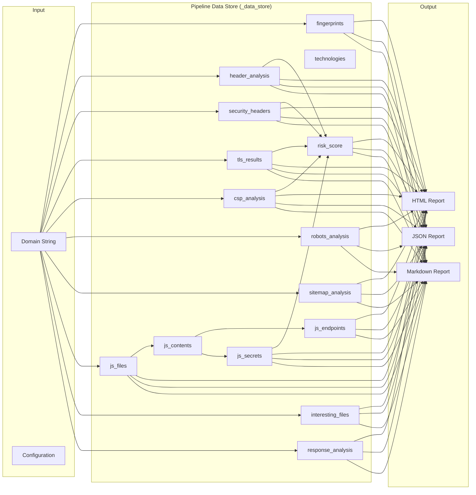
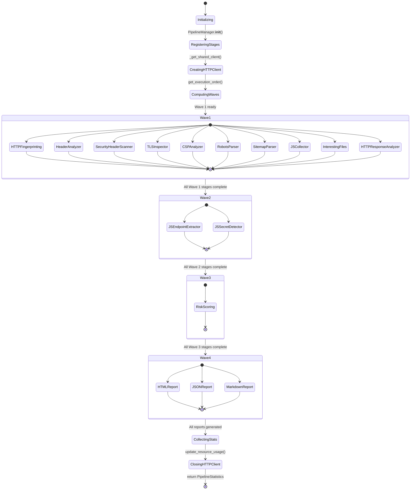
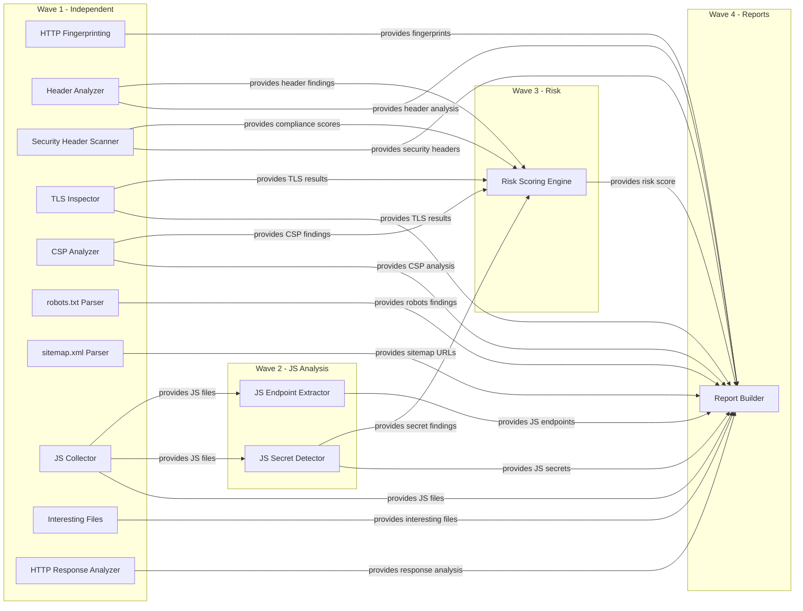

# ReconForgeX — Architecture

## Table of Contents

- [Component Architecture](#component-architecture)
- [Execution Flow](#execution-flow)
- [Data Flow](#data-flow)
- [Pipeline](#pipeline)
- [Scheduler](#scheduler)
- [Dependency Graph](#dependency-graph)

---

## Component Architecture

```mermaid
graph TB
    subgraph "CLI Layer"
        CLI[cli.py<br/>Argument Parsing]
        CFG[config.py<br/>YAML Config]
        VAL[validators.py<br/>Input Validation]
    end
    
    subgraph "Pipeline Layer"
        PM[pipeline/manager.py<br/>PipelineManager]
        SCH[pipeline/scheduler.py<br/>PipelineScheduler]
        WP[pipeline/worker_pool.py<br/>WorkerPool]
        STATS[pipeline/statistics.py<br/>PipelineStatistics]
        PROG[pipeline/progress.py<br/>ProgressMonitor]
    end
    
    subgraph "Module Layer"
        BASE[modules/base.py<br/>BaseModule]
        M1[modules/http_fingerprint.py]
        M2[modules/header_analyzer.py]
        M3[modules/security_header_scanner.py]
        M4[modules/tls_inspector.py]
        M5[modules/csp_analyzer.py]
        M6[modules/robots_parser.py]
        M7[modules/sitemap_parser.py]
        M8[modules/js_collector.py]
        M9[modules/js_endpoint_extractor.py]
        M10[modules/js_secret_detector.py]
        M11[modules/interesting_files.py]
        M12[modules/http_response_analyzer.py]
        M13[modules/risk_scoring.py]
    end
    
    subgraph "HTTP Layer"
        HTTP[utils/http_client.py<br/>AsyncHTTPClient]
        RL[utils/rate_limiter.py<br/>RateLimiter]
    end
    
    subgraph "Report Layer"
        HTML[report/html_report.py]
        JSON[report/json_report.py]
        MD[report/markdown_report.py]
    end
    
    subgraph "Utilities"
        FILES[utils/files.py]
        PROC[utils/process.py]
        EXC[exceptions.py]
        LOG[logger.py]
        CONST[constants.py]
    end
    
    CLI --> PM
    CLI --> CFG
    CLI --> VAL
    PM --> SCH
    PM --> WP
    PM --> STATS
    PM --> PROG
    PM --> BASE
    BASE --> M1
    BASE --> M2
    BASE --> M3
    BASE --> M4
    BASE --> M5
    BASE --> M6
    BASE --> M7
    BASE --> M8
    BASE --> M9
    BASE --> M10
    BASE --> M11
    BASE --> M12
    BASE --> M13
    M1 --> HTTP
    M2 --> HTTP
    M3 --> HTTP
    M4 --> HTTP
    M5 --> HTTP
    M6 --> HTTP
    M7 --> HTTP
    M8 --> HTTP
    M11 --> HTTP
    M12 --> HTTP
    HTTP --> RL
    PM --> HTML
    PM --> JSON
    PM --> MD
    PM --> FILES
    PM --> LOG
    PM --> CONST
```



### Layer Responsibilities

| Layer | Components | Responsibility |
|-------|-----------|----------------|
| **CLI** | `cli.py`, `config.py`, `validators.py` | Parse arguments, load config, validate input, create output dirs |
| **Pipeline** | `manager.py`, `scheduler.py`, `worker_pool.py`, `statistics.py`, `progress.py` | Orchestrate execution, manage concurrency, collect telemetry |
| **Module** | 13 module files extending `base.py` | Implement reconnaissance logic |
| **HTTP** | `http_client.py`, `rate_limiter.py` | Provide async HTTP with retry, backoff, rate limiting |
| **Report** | `html_report.py`, `json_report.py`, `markdown_report.py` | Generate output reports |
| **Utilities** | `files.py`, `process.py`, `exceptions.py`, `logger.py`, `constants.py` | Shared infrastructure |

## Execution Flow

```mermaid
sequenceDiagram
    actor User
    participant CLI as cli.py
    participant CFG as config.py
    participant PM as PipelineManager
    participant SCH as PipelineScheduler
    participant WP as WorkerPool
    participant HTTP as AsyncHTTPClient
    participant MOD as Modules
    participant REP as Report Layer
    
    User->>CLI: reconforgex -d example.com
    CLI->>CFG: load_config()
    CFG-->>CLI: config dict
    CLI->>CLI: validate_domain()
    CLI->>CLI: create_output_dirs()
    CLI->>PM: PipelineManager(config)
    CLI->>PM: run()
    
    PM->>PM: _register_default_stages()
    PM->>HTTP: _get_shared_client()
    HTTP-->>PM: AsyncHTTPClient instance
    
    PM->>SCH: get_execution_order()
    SCH-->>PM: [[Wave 1], [Wave 2], [Wave 3], [Wave 4]]
    
    loop Wave 1 (10 concurrent stages)
        PM->>PM: create tasks for each stage
        par HTTP Fingerprinting
            PM->>MOD: _run_http_fingerprint()
            MOD->>HTTP: GET requests
            HTTP-->>MOD: HTTPResponse[]
            MOD-->>PM: StageResult
        and Header Analyzer
            PM->>MOD: _run_header_analyzer()
            MOD->>HTTP: GET requests
            HTTP-->>MOD: HTTPResponse[]
            MOD-->>PM: StageResult
        and Security Header Scanner
            PM->>MOD: _run_security_header_scanner()
            MOD->>HTTP: GET requests
            HTTP-->>MOD: HTTPResponse[]
            MOD-->>PM: StageResult
        and TLS Inspector
            PM->>MOD: _run_tls_inspector()
            MOD->>HTTP: GET requests
            HTTP-->>MOD: HTTPResponse[]
            MOD-->>PM: StageResult
        and CSP Analyzer
            PM->>MOD: _run_csp_analyzer()
            MOD->>HTTP: GET requests
            HTTP-->>MOD: HTTPResponse[]
            MOD-->>PM: StageResult
        and robots.txt Parser
            PM->>MOD: _run_robots_parser()
            MOD->>HTTP: GET /robots.txt
            HTTP-->>MOD: HTTPResponse
            MOD-->>PM: StageResult
        and sitemap.xml Parser
            PM->>MOD: _run_sitemap_parser()
            MOD->>HTTP: GET /sitemap.xml
            HTTP-->>MOD: HTTPResponse
            MOD-->>PM: StageResult
        and JS Collector
            PM->>MOD: _run_js_collector()
            MOD->>HTTP: GET page + JS files
            HTTP-->>MOD: HTTPResponse[]
            MOD-->>PM: StageResult
        and Interesting Files
            PM->>MOD: _run_interesting_files()
            MOD->>HTTP: GET 60+ paths
            HTTP-->>MOD: HTTPResponse[]
            MOD-->>PM: StageResult
        and HTTP Response Analyzer
            PM->>MOD: _run_response_analyzer()
            MOD->>HTTP: GET requests
            HTTP-->>MOD: HTTPResponse[]
            MOD-->>PM: StageResult
    end
    
    PM->>PM: store results in _data_store
    
    loop Wave 2 (JS analysis)
        par JS Endpoint Extractor
            PM->>MOD: _run_js_endpoint_extractor()
            MOD->>PM: read js_contents from _data_store
            MOD-->>PM: StageResult
        and JS Secret Detector
            PM->>MOD: _run_js_secret_detector()
            MOD->>PM: read js_contents from _data_store
            MOD-->>PM: StageResult
    end
    
    PM->>PM: store results in _data_store
    
    loop Wave 3 (Risk Scoring)
        PM->>MOD: _run_risk_scoring()
        MOD->>PM: read header, TLS, CSP, secret results
        MOD-->>PM: StageResult
    end
    
    PM->>PM: store results in _data_store
    
    loop Wave 4 (Report Generation)
        PM->>REP: build_html_report()
        PM->>REP: build_json_report()
        PM->>REP: build_markdown_report()
        REP-->>PM: report files written
    end
    
    PM->>PM: collect HTTP client statistics
    PM->>PM: update resource usage
    PM->>HTTP: close()
    PM-->>CLI: PipelineStatistics
    
    CLI->>User: print summary
```

## Data Flow



### Data Store Keys

| Key | Source Module | Type | Description |
|-----|--------------|------|-------------|
| `fingerprints` | HTTP Fingerprinting | `List[Dict]` | Technology fingerprints per URL |
| `technologies` | HTTP Fingerprinting | `List[str]` | Unique technologies detected |
| `header_analysis` | Header Analyzer | `List[Dict]` | Header security findings |
| `security_headers` | Security Header Scanner | `List[Dict]` | OWASP header compliance results |
| `tls_results` | TLS Inspector | `List[Dict]` | TLS certificate details |
| `csp_analysis` | CSP Analyzer | `List[Dict]` | CSP weakness analysis |
| `robots_analysis` | robots.txt Parser | `List[Dict]` | Parsed robots.txt entries |
| `sitemap_analysis` | sitemap.xml Parser | `List[Dict]` | Parsed sitemap URLs |
| `js_files` | JS Collector | `List[Dict]` | Discovered JS file metadata |
| `js_contents` | JS Collector | `List[Tuple]` | (url, content) pairs for JS analysis |
| `js_endpoints` | JS Endpoint Extractor | `List[Dict]` | Extracted API endpoints |
| `js_secrets` | JS Secret Detector | `List[Dict]` | Detected secrets and credentials |
| `interesting_files` | Interesting Files | `List[Dict]` | Discovered interesting paths |
| `response_analysis` | HTTP Response Analyzer | `List[Dict]` | Response pattern analysis |
| `risk_score` | Risk Scoring Engine | `List[Dict]` | Aggregated risk assessment |

## Pipeline



### Pipeline States

| State | Description |
|-------|-------------|
| `Initializing` | Config loaded, output dirs created |
| `RegisteringStages` | All 13 stages registered with scheduler |
| `CreatingHTTPClient` | Shared AsyncHTTPClient initialized |
| `ComputingWaves` | Scheduler computes topological order |
| `Wave 1` | 10 independent stages run concurrently |
| `Wave 2` | JS analysis stages (depend on JS Collector) |
| `Wave 3` | Risk scoring (depends on analysis modules) |
| `Wave 4` | Report generation (depends on all modules) |
| `CollectingStats` | HTTP client stats aggregated, resource usage updated |
| `ClosingHTTPClient` | Shared client closed, connections released |

## Scheduler

```mermaid
graph TD
    subgraph "Scheduler Internals"
        REG[register(stage)]
        TOPO[get_execution_order]
        KAHN[Kahn's Algorithm]
        WAVES[Wave Grouping]
        CYCLE[Cycle Detection]
    end
    
    subgraph "Stage Registration"
        S1[Stage: name, description, depends_on, func]
        S2[Stage: name, description, depends_on, func]
        S3[Stage: name, description, depends_on, func]
    end
    
    S1 --> REG
    S2 --> REG
    S3 --> REG
    REG --> TOPO
    TOPO --> KAHN
    KAHN --> WAVES
    KAHN --> CYCLE
    WAVES --> RESULT[[List[List[Stage]]]]
    CYCLE --> ERROR[Cycle detected warning]
```

### Kahn's Algorithm Implementation

```python
def get_execution_order(self) -> List[List[Stage]]:
    # Build in-degree map and dependency graph
    in_degree = {name: 0 for name in self._stages}
    dependents = {name: [] for name in self._stages}
    
    for name, stage in self._stages.items():
        for dep in stage.depends_on:
            if dep in self._stages:
                in_degree[name] += 1
                dependents[dep].append(name)
    
    # Start with stages that have no dependencies
    waves = []
    queue = [name for name, deg in in_degree.items() if deg == 0]
    
    while queue:
        wave = []
        next_queue = []
        for name in queue:
            wave.append(self._stages[name])
            for dep_name in dependents[name]:
                in_degree[dep_name] -= 1
                if in_degree[dep_name] == 0:
                    next_queue.append(dep_name)
        waves.append(wave)
        queue = next_queue
    
    return waves
```

### Stage Dataclass

```python
@dataclass
class Stage:
    name: str                    # Unique identifier
    description: str             # Human-readable description
    depends_on: List[str]        # Stage names that must complete first
    run_async: bool              # Can run concurrently with other stages
    func: Optional[Callable]     # Async callable implementing stage logic
```

## Dependency Graph



### Dependency Matrix

| Stage | Dependencies | Dependents | Wave |
|-------|-------------|------------|------|
| HTTP Fingerprinting | — | Report Builder | 1 |
| Header Analyzer | — | Risk Scoring, Report Builder | 1 |
| Security Header Scanner | — | Risk Scoring, Report Builder | 1 |
| TLS Inspector | — | Risk Scoring, Report Builder | 1 |
| CSP Analyzer | — | Risk Scoring, Report Builder | 1 |
| robots.txt Parser | — | Report Builder | 1 |
| sitemap.xml Parser | — | Report Builder | 1 |
| JS Collector | — | JS Endpoint Extractor, JS Secret Detector, Report Builder | 1 |
| Interesting Files | — | Report Builder | 1 |
| HTTP Response Analyzer | — | Report Builder | 1 |
| JS Endpoint Extractor | JS Collector | Report Builder | 2 |
| JS Secret Detector | JS Collector | Risk Scoring, Report Builder | 2 |
| Risk Scoring Engine | Header Analyzer, Security Headers, TLS, CSP, JS Secrets | Report Builder | 3 |
| Report Builder | All 13 modules | — | 4 |

### Why This Dependency Structure

1. **Wave 1 modules are independent** because they only need the target domain and HTTP client. They can all run concurrently.
2. **JS analysis depends on JS Collector** because the endpoint extractor and secret detector need the JavaScript source code collected from web pages.
3. **Risk scoring depends on analysis modules** because it aggregates findings from header analysis, TLS inspection, CSP analysis, and secret detection.
4. **Report generation depends on all modules** because it needs every module's results to build comprehensive reports.