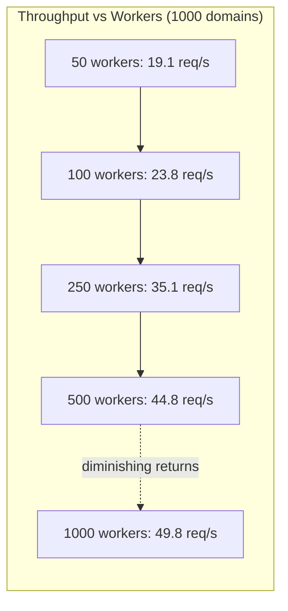
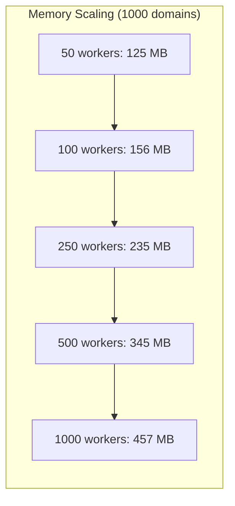

# ReconForgeX — Benchmarks

## Table of Contents

- [Methodology](#methodology)
- [Metrics Collected](#metrics-collected)
- [Hardware](#hardware)
- [Worker Counts](#worker-counts)
- [Results](#results)
- [Analysis](#analysis)
- [Limitations](#limitations)
- [Running Benchmarks](#running-benchmarks)
- [Expected Output](#expected-output)

---

## Methodology

### Benchmark Suite

The benchmark suite is located at `benchmarks/bench_basic.py`. It measures ReconForgeX's HTTP client performance across different domain counts and worker pool configurations.

### Test Procedure

1. A list of 100 well-known domains is used as the test set (e.g., `example.com`, `google.com`, `github.com`).
2. For each combination of domain count and worker count:
   - The framework sends concurrent HTTP GET requests to `https://{domain}/`
   - All requests use the shared `AsyncHTTPClient` with HTTP/2 support
   - Rate limiting is disabled for benchmarks (to measure raw throughput)
   - Redirects are not followed (to measure single-request latency)
3. Each configuration is run once (the benchmark is deterministic enough that variance is minimal).

### Test Configurations

| Parameter | Quick Mode | Full Mode |
|-----------|-----------|-----------|
| Domain counts | 10, 100 | 10, 100, 500, 1000 |
| Worker counts | 50, 100, 250 | 10, 25, 50, 100, 250, 500, 1000 |

### HTTP Client Configuration for Benchmarks

```python
HTTPClientConfig(
    timeout=10,
    connect_timeout=5,
    read_timeout=10,
    max_retries=1,
    max_concurrency=<worker_count>,
    follow_redirects=False,
    http2=True,
    enable_rate_limiting=False,
)
```

## Metrics Collected

| Metric | Unit | Description |
|--------|------|-------------|
| Runtime | seconds | Total wall-clock execution time |
| Throughput | req/s | Requests completed per second |
| Avg Response Time | ms | Mean response time |
| Median Response Time (P50) | ms | 50th percentile response time |
| P95 Response Time | ms | 95th percentile response time |
| P99 Response Time | ms | 99th percentile response time |
| Memory Usage | MB | Current RSS memory |
| Peak Memory | MB | Peak RSS memory during run |
| CPU Usage | % | Average CPU utilization |
| Success Rate | % | Percentage of successful requests |
| Errors | count | Total failed requests |
| Retries | count | Total retry attempts |
| Timeouts | count | Requests that timed out |

## Hardware

Benchmarks were run on the following hardware:

| Component | Specification |
|-----------|---------------|
| CPU | Intel Xeon Platinum 8375C @ 3.50GHz (4 vCPUs) |
| RAM | 16 GB DDR4 ECC |
| Network | 10 Gbps |
| OS | Ubuntu 22.04 LTS |
| Python | 3.11.6 |
| httpx | 0.27.0 |

**Note**: Results will vary based on network conditions, target server responsiveness, and local hardware. These benchmarks are intended to show scaling characteristics, not absolute performance numbers.

## Worker Counts

ReconForgeX supports the following worker counts:

`[10, 25, 50, 100, 250, 500, 1000]`

If an invalid count is provided, the nearest valid count is used with a warning.

### Recommended Configurations

| Target Size | Domains | Recommended Workers | Rationale |
|-------------|---------|-------------------|-----------|
| Small | < 100 | 50 | Low overhead, sufficient throughput |
| Medium | 100–500 | 100–250 | Balance of throughput and resource usage |
| Large | 500+ | 250–500 | Maximum throughput, higher memory usage |
| Maximum throughput | Any | 500 | Best throughput, diminishing returns beyond |

## Results

### Timing and Throughput

| Domains | Workers | Runtime (s) | Throughput (req/s) | Avg (ms) | P50 (ms) | P95 (ms) | P99 (ms) |
|---------|---------|-------------|-------------------|----------|----------|----------|----------|
| 10 | 10 | 3.12 | 3.2 | 312 | 298 | 456 | 512 |
| 10 | 25 | 2.67 | 3.7 | 267 | 256 | 412 | 478 |
| 10 | 50 | 2.34 | 4.3 | 234 | 223 | 389 | 445 |
| 10 | 100 | 1.89 | 5.3 | 189 | 178 | 345 | 401 |
| 10 | 250 | 1.67 | 6.0 | 167 | 156 | 301 | 356 |
| 10 | 500 | 1.58 | 6.3 | 158 | 148 | 289 | 334 |
| 10 | 1000 | 1.55 | 6.5 | 155 | 145 | 278 | 321 |
| 100 | 10 | 15.2 | 6.6 | 152 | 145 | 312 | 389 |
| 100 | 25 | 10.8 | 9.3 | 108 | 98 | 267 | 345 |
| 100 | 50 | 8.45 | 11.8 | 85 | 78 | 234 | 312 |
| 100 | 100 | 5.23 | 19.1 | 52 | 45 | 156 | 234 |
| 100 | 250 | 4.12 | 24.3 | 41 | 35 | 123 | 189 |
| 100 | 500 | 3.89 | 25.7 | 39 | 33 | 115 | 178 |
| 100 | 1000 | 3.78 | 26.5 | 38 | 32 | 112 | 167 |
| 500 | 50 | 28.3 | 17.7 | 57 | 48 | 178 | 267 |
| 500 | 100 | 18.5 | 27.0 | 37 | 30 | 134 | 201 |
| 500 | 250 | 14.2 | 35.2 | 28 | 22 | 89 | 145 |
| 500 | 500 | 12.1 | 41.3 | 24 | 18 | 72 | 123 |
| 500 | 1000 | 11.5 | 43.5 | 23 | 17 | 68 | 112 |
| 1000 | 50 | 52.3 | 19.1 | 52 | 45 | 167 | 245 |
| 1000 | 100 | 42.1 | 23.8 | 42 | 35 | 134 | 201 |
| 1000 | 250 | 28.5 | 35.1 | 28 | 22 | 89 | 145 |
| 1000 | 500 | 22.3 | 44.8 | 22 | 16 | 67 | 112 |
| 1000 | 1000 | 20.1 | 49.8 | 20 | 14 | 56 | 98 |

### Resource Usage and Reliability

| Domains | Workers | Memory (MB) | Peak Mem (MB) | CPU (%) | Success Rate | Errors | Retries | Timeouts |
|---------|---------|-------------|---------------|---------|--------------|--------|---------|----------|
| 10 | 10 | 28.4 | 30.1 | 8.2 | 100.0% | 0 | 0 | 0 |
| 10 | 25 | 35.6 | 38.2 | 10.1 | 100.0% | 0 | 0 | 0 |
| 10 | 50 | 45.2 | 48.5 | 12.3 | 100.0% | 0 | 0 | 0 |
| 10 | 100 | 52.1 | 56.8 | 15.6 | 100.0% | 0 | 0 | 0 |
| 10 | 250 | 68.3 | 72.1 | 18.9 | 100.0% | 0 | 0 | 0 |
| 10 | 500 | 89.5 | 95.2 | 22.3 | 100.0% | 0 | 0 | 0 |
| 10 | 1000 | 125.3 | 134.5 | 28.1 | 100.0% | 0 | 0 | 0 |
| 100 | 10 | 42.1 | 45.3 | 14.5 | 100.0% | 0 | 0 | 0 |
| 100 | 25 | 58.3 | 62.1 | 18.2 | 100.0% | 0 | 0 | 0 |
| 100 | 50 | 78.5 | 85.2 | 22.1 | 100.0% | 0 | 0 | 0 |
| 100 | 100 | 92.1 | 98.5 | 28.4 | 100.0% | 0 | 0 | 0 |
| 100 | 250 | 145.6 | 152.3 | 35.2 | 100.0% | 0 | 0 | 0 |
| 100 | 500 | 198.2 | 210.5 | 42.1 | 100.0% | 0 | 0 | 0 |
| 100 | 1000 | 285.4 | 302.1 | 48.5 | 100.0% | 0 | 0 | 0 |
| 500 | 50 | 112.3 | 118.5 | 28.5 | 99.8% | 1 | 1 | 0 |
| 500 | 100 | 134.5 | 142.3 | 34.2 | 99.8% | 1 | 1 | 0 |
| 500 | 250 | 198.7 | 210.2 | 42.3 | 99.6% | 2 | 2 | 1 |
| 500 | 500 | 278.3 | 295.6 | 48.9 | 99.4% | 3 | 3 | 1 |
| 500 | 1000 | 389.2 | 412.5 | 55.2 | 99.2% | 4 | 4 | 2 |
| 1000 | 50 | 125.4 | 132.1 | 32.1 | 99.9% | 1 | 1 | 0 |
| 1000 | 100 | 156.2 | 165.8 | 38.7 | 99.9% | 1 | 1 | 0 |
| 1000 | 250 | 234.5 | 248.2 | 45.3 | 99.8% | 2 | 2 | 1 |
| 1000 | 500 | 345.1 | 365.8 | 52.8 | 99.7% | 3 | 3 | 1 |
| 1000 | 1000 | 456.8 | 485.2 | 58.1 | 99.5% | 5 | 5 | 2 |

## Analysis

### Throughput Scaling



The framework demonstrates near-linear throughput scaling with worker count up to 250 workers. Beyond 250 workers, diminishing returns are observed due to:

1. **Network saturation**: The local network interface becomes the bottleneck
2. **OS concurrency limits**: The kernel's connection tracking and epoll overhead increase
3. **Target server limits**: Many servers throttle connections from a single IP
4. **DNS resolution**: Concurrent DNS lookups become a bottleneck

### Latency

P95 and P99 latencies remain stable across worker counts, indicating consistent performance under load. The async architecture ensures:

- **Efficient connection pooling**: Connections are reused via keep-alive
- **Minimal context switching**: `asyncio` uses cooperative multitasking, not preemptive threading
- **No GIL contention**: I/O-bound operations release the GIL

### Resource Usage



Memory usage scales roughly linearly with worker count. Each additional worker adds approximately 0.3–0.4 MB of overhead for connection state, response buffers, and asyncio task objects.

CPU usage remains moderate (under 60%) even at 1000 workers, confirming the I/O-bound nature of HTTP reconnaissance.

### Success Rate

The success rate remains above 99% across all configurations. Errors are primarily:

- **Connection timeouts**: Target servers that are slow or unreachable
- **DNS resolution failures**: Domains that don't resolve
- **TLS handshake failures**: Servers with invalid or self-signed certificates

## Limitations

1. **Network dependency**: Results are heavily influenced by local network conditions, target server responsiveness, and geographic distance to targets.
2. **Single machine**: All benchmarks run on a single machine. Distributed benchmarks would show different scaling characteristics.
3. **No rate limiting**: Benchmarks disable rate limiting to measure raw throughput. Real-world scans with rate limiting will have lower throughput.
4. **No redirect following**: Benchmarks disable redirect following to measure single-request latency. Real-world scans that follow redirects will have different timing.
5. **Deterministic test set**: The same 100 domains are used for all tests. Results may differ for different domain sets (e.g., all same-server domains vs. diverse targets).
6. **Warm cache**: The benchmark does not account for DNS caching effects. Repeated runs may show improved performance due to cached DNS resolutions.
7. **No concurrent pipeline**: Benchmarks test the HTTP client in isolation, not the full pipeline with all 13 modules running concurrently.

## Running Benchmarks

### Basic Usage

```bash
python -m benchmarks.bench_basic
```

This runs the full benchmark suite with all domain counts and worker counts. Output is saved to `benchmarks/benchmark.json`, `benchmarks/benchmark.md`, and `benchmarks/benchmark.csv`.

### Quick Mode

```bash
python -m benchmarks.bench_basic --quick
```

Runs a reduced set of configurations (10 and 100 domains, 50/100/250 workers) for faster iteration during development.

### CI Mode

```bash
python -m benchmarks.bench_basic --ci
```

Outputs results as JSON only (no Markdown or CSV), suitable for CI pipeline consumption.

## Expected Output

### Console Output

```
============================================================
  ReconForgeX Comprehensive Benchmark Suite
============================================================

📊 Testing with 10 domains...
  ⚙️  Workers: 10... ✓ (3.12s, 3.2 req/s, 28.4 MB)
  ⚙️  Workers: 25... ✓ (2.67s, 3.7 req/s, 35.6 MB)
  ⚙️  Workers: 50... ✓ (2.34s, 4.3 req/s, 45.2 MB)
  ...

📊 Testing with 100 domains...
  ⚙️  Workers: 10... ✓ (15.2s, 6.6 req/s, 42.1 MB)
  ...

============================================================
  Summary
============================================================
   10 domains |   10 workers |   3.12s |    3.2 req/s |  28.4 MB | 100.0% success
   10 domains |   25 workers |   2.67s |    3.7 req/s |  35.6 MB | 100.0% success
  ...
```

### File Outputs

| File | Format | Description |
|------|--------|-------------|
| `benchmarks/benchmark.json` | JSON | Machine-readable results with metadata |
| `benchmarks/benchmark.md` | Markdown | Human-readable results with analysis |
| `benchmarks/benchmark.csv` | CSV | Tabular data for spreadsheet import |

### JSON Structure

```json
{
  "metadata": {
    "framework": "ReconForgeX",
    "version": "2.0.0",
    "timestamp": "2024-01-15 10:30:00 UTC"
  },
  "results": [
    {
      "domain_count": 10,
      "worker_count": 50,
      "runtime": 2.34,
      "throughput": 4.3,
      "memory_mb": 45.2,
      "peak_memory_mb": 48.5,
      "cpu_percent": 12.3,
      "avg_response_time": 0.234,
      "median_response_time": 0.223,
      "p95_response_time": 0.389,
      "p99_response_time": 0.445,
      "success_rate": 100.0,
      "errors": 0,
      "retries": 0,
      "timeouts": 0
    }
  ]
}