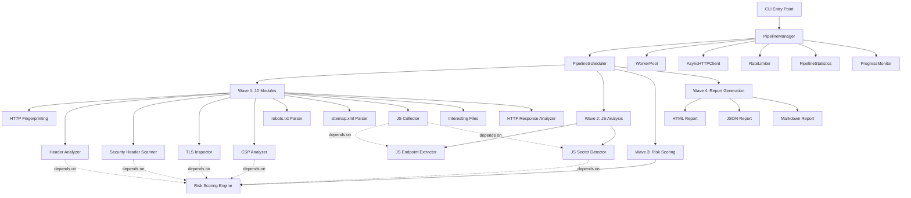
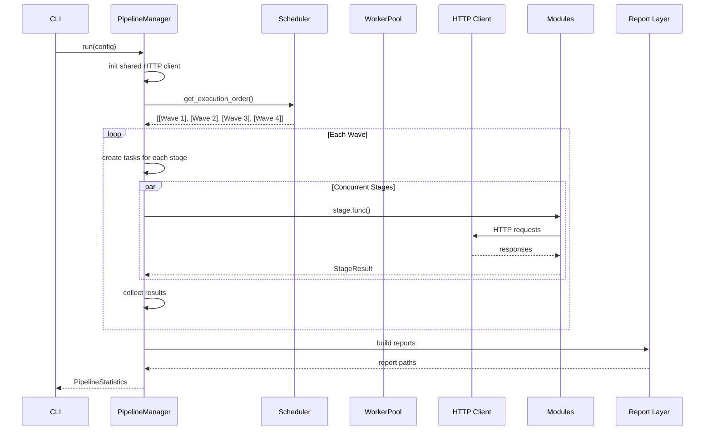
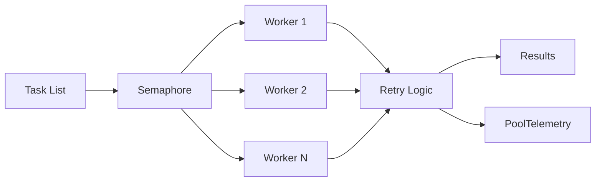
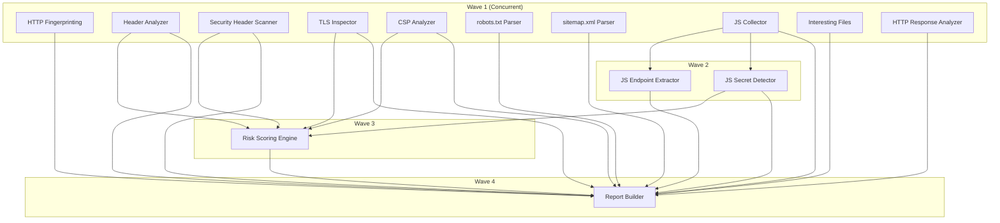
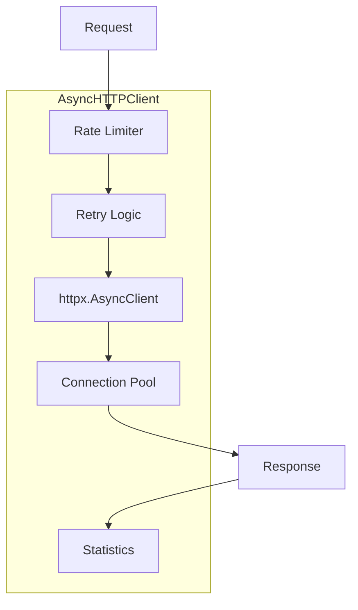

# ReconForgeX — Project Documentation

## Table of Contents

- [Project Motivation](#project-motivation)
- [Goals](#goals)
- [Architecture Overview](#architecture-overview)
- [Directory Structure](#directory-structure)
- [Execution Pipeline](#execution-pipeline)
- [Worker Pool](#worker-pool)
- [Scheduler](#scheduler)
- [Modules](#modules)
- [HTTP Engine](#http-engine)
- [Rate Limiter](#rate-limiter)
- [Statistics Collection](#statistics-collection)
- [Report Generation](#report-generation)
- [Configuration](#configuration)
- [Plugin Architecture](#plugin-architecture)
- [Testing](#testing)
- [Benchmarks](#benchmarks)
- [Current Limitations](#current-limitations)
- [Future Plans](#future-plans)

---

## Project Motivation

ReconForgeX was created to address a specific problem in the security reconnaissance space: existing tools are either wrappers around external binaries (subfinder, httpx, nmap, nuclei, aquatone) or require complex multi-tool setups. This creates dependency hell, version conflicts, and inconsistent behavior across environments.

The core insight is that **HTTP-based reconnaissance can be implemented entirely in Python** using modern async libraries. There is no fundamental need to shell out to external tools for:

- HTTP fingerprinting (headers + body patterns)
- TLS/SSL inspection (Python's `ssl` module)
- robots.txt/sitemap.xml parsing (standard XML/HTTP)
- JavaScript analysis (regex + pattern matching)
- Security header scanning (HTTP response analysis)

ReconForgeX implements all 13 reconnaissance modules in pure Python with zero external tool dependencies. The only runtime dependencies are `httpx` (HTTP client) and `pyyaml` (configuration parsing).

## Goals

1. **Zero external tool dependencies** — Every module is implemented in pure Python. No subfinder, no nmap, no nuclei, no httpx binary.
2. **Async-first architecture** — Full `asyncio` throughout. The entire pipeline runs concurrently with no blocking I/O.
3. **Configurable concurrency** — Worker pool supports 10–1000 concurrent workers with adaptive concurrency control.
4. **Comprehensive telemetry** — P50/P95/P99 latency, throughput, memory, CPU, per-module statistics.
5. **Beautiful reports** — HTML reports with Chart.js visualizations, JSON for machine consumption, Markdown for quick review.
6. **Extensible** — Plugin system with standardized module interface.
7. **Production reliability** — Retry with exponential backoff, timeouts, cancellation, graceful shutdown.

## Architecture Overview



### Component Interaction

The architecture follows a layered design:

1. **CLI Layer** (`cli.py`): Parses arguments, loads configuration, validates input, creates output directories.
2. **Pipeline Layer** (`pipeline/`): Orchestrates execution, manages concurrency, collects statistics.
3. **Module Layer** (`modules/`): 13 reconnaissance modules implementing the `BaseModule` interface.
4. **HTTP Layer** (`utils/http_client.py`): Shared async HTTP client with connection pooling.
5. **Report Layer** (`report/`): Generates HTML, JSON, and Markdown reports from collected data.

### Design Decisions

**Why a single shared HTTP client?**
All modules share one `AsyncHTTPClient` instance. This enables connection pooling across the entire pipeline, unified rate limiting, and centralized statistics collection. Each module receives the client via dependency injection (`set_http_client()`).

**Why topological scheduling?**
Modules have data dependencies (e.g., JS Endpoint Extractor depends on JS Collector). The scheduler uses Kahn's algorithm to compute a topological ordering, grouping independent stages into concurrent waves. This maximizes parallelism while respecting data flow.

**Why dataclasses for results?**
Every module returns typed dataclass instances. This provides IDE autocompletion, type checking, and clear serialization paths. Results are converted to dictionaries only at the report boundary.

**Why no external tools?**
Eliminating external tool dependencies means:
- No version conflicts
- No binary compatibility issues
- Reproducible behavior across environments
- Single `pip install` setup
- Easier CI/CD integration

## Directory Structure

```
reconforgex/
├── __init__.py              # Package entry point, version exports
├── __main__.py              # python -m reconforgex support
├── cli.py                   # CLI argument parsing and dispatch
├── config.py                # YAML-based configuration loading
├── constants.py             # Centralized constants and module mappings
├── exceptions.py            # Custom exception hierarchy
├── logger.py                # Structured logging configuration
├── modules/
│   ├── __init__.py          # Module exports
│   ├── base.py              # Abstract base class (run, metadata, statistics, health, configuration)
│   ├── http_fingerprint.py  # HTTP fingerprinting (30+ technologies)
│   ├── header_analyzer.py   # HTTP header security analysis
│   ├── security_header_scanner.py  # OWASP security header compliance
│   ├── tls_inspector.py     # TLS/SSL certificate inspection
│   ├── csp_analyzer.py      # Content Security Policy analysis
│   ├── robots_parser.py     # robots.txt parsing
│   ├── sitemap_parser.py    # sitemap.xml parsing
│   ├── js_collector.py      # JavaScript file collection
│   ├── js_endpoint_extractor.py  # API endpoint extraction from JS
│   ├── js_secret_detector.py     # Secret detection in JS
│   ├── interesting_files.py      # Interesting files discovery
│   ├── http_response_analyzer.py # HTTP response analysis
│   └── risk_scoring.py      # Risk scoring engine
├── pipeline/
│   ├── __init__.py
│   ├── manager.py           # Pipeline orchestration (13 stages)
│   ├── scheduler.py         # DAG-based stage scheduler (Kahn's algorithm)
│   ├── statistics.py        # Execution statistics (P50, P95, P99, throughput, etc.)
│   ├── worker_pool.py       # Configurable async worker pool with adaptive concurrency
│   └── progress.py          # Real-time terminal progress monitor
├── report/
│   ├── __init__.py
│   ├── html_report.py       # Standalone HTML report with Chart.js
│   ├── json_report.py       # Machine-readable JSON report
│   └── markdown_report.py   # Human-readable Markdown report
└── utils/
    ├── __init__.py
    ├── files.py             # File I/O utilities
    ├── http_client.py       # Async HTTP client with retry/backoff
    ├── process.py           # Process execution utilities
    ├── rate_limiter.py      # Token bucket rate limiter
    └── validators.py        # Input validation (domain, URL, etc.)

benchmarks/
├── __init__.py
└── bench_basic.py           # Comprehensive benchmark suite

configs/
└── default.yaml             # Default configuration file

tests/
├── __init__.py
├── test_cli.py              # CLI argument parsing tests
├── test_config.py           # Configuration loading tests
├── test_pipeline_scheduler.py  # Scheduler DAG tests
├── test_report.py           # Report generation tests
└── test_validators.py       # Input validation tests
```

## Execution Pipeline



### Pipeline Flow

1. **Initialization**: `PipelineManager.__init__()` registers all 13 stages with their dependencies.
2. **Execution Order**: `PipelineScheduler.get_execution_order()` computes topological waves using Kahn's algorithm.
3. **Wave Execution**: Each wave's stages run concurrently via `asyncio.gather()`.
4. **Data Flow**: Stage results are stored in `_data_store` dict, accessible by dependent stages.
5. **Report Generation**: After all stages complete, reports are built from the accumulated data.

### Stage Dependencies

| Stage | Depends On | Wave |
|-------|-----------|------|
| HTTP Fingerprinting | — | 1 |
| Header Analyzer | — | 1 |
| Security Header Scanner | — | 1 |
| TLS Inspector | — | 1 |
| CSP Analyzer | — | 1 |
| robots.txt Parser | — | 1 |
| sitemap.xml Parser | — | 1 |
| JS Collector | — | 1 |
| Interesting Files | — | 1 |
| HTTP Response Analyzer | — | 1 |
| JS Endpoint Extractor | JS Collector | 2 |
| JS Secret Detector | JS Collector | 2 |
| Risk Scoring | Header Analyzer, Security Headers, TLS, CSP, JS Secrets | 3 |
| Report Builder | All 13 modules | 4 |

## Worker Pool

The `WorkerPool` class (`pipeline/worker_pool.py`) provides configurable async concurrency.

### Why It Exists

HTTP reconnaissance is I/O-bound. The bottleneck is network latency, not CPU. A worker pool allows the framework to issue many concurrent requests, saturating the network connection while respecting target rate limits.

### How It Works



1. **Semaphore-based concurrency**: An `asyncio.Semaphore` limits the number of concurrent tasks.
2. **TaskGroup**: Uses Python 3.11+ `asyncio.TaskGroup` for structured concurrency.
3. **Retry with backoff**: Failed tasks are retried with exponential backoff (base 1.0s, multiplier 2.0x, max 60s).
4. **Adaptive concurrency**: If average latency exceeds a threshold, concurrency is reduced. If latency is low, concurrency is increased.
5. **Cancellation**: All pending tasks can be cancelled via `cancel()`.
6. **Graceful shutdown**: On exit, waits for remaining tasks with a 10-second timeout.

### Configuration

| Parameter | Default | Description |
|-----------|---------|-------------|
| `worker_count` | 50 | Max concurrent workers (10, 25, 50, 100, 250, 500, 1000) |
| `task_timeout` | 60.0 | Per-task timeout in seconds |
| `max_retries` | 2 | Number of retry attempts |
| `backoff_base` | 1.0 | Initial backoff in seconds |
| `backoff_multiplier` | 2.0 | Exponential backoff multiplier |
| `max_backoff` | 60.0 | Maximum backoff in seconds |
| `adaptive_concurrency` | True | Enable adaptive concurrency adjustment |
| `adaptive_target_latency` | 2.0 | Target average latency in seconds |

### Valid Worker Counts

`[10, 25, 50, 100, 250, 500, 1000]`

If an invalid count is provided, the nearest valid count is used with a warning.

## Scheduler

The `PipelineScheduler` class (`pipeline/scheduler.py`) determines execution order and concurrency.

### Why It Exists

Modules have data dependencies. For example, JS Endpoint Extractor needs the JavaScript files collected by JS Collector. Running modules in the wrong order would produce incorrect results. Running all modules sequentially would be slow. The scheduler solves both problems.

### How It Works



1. **DAG Construction**: Stages are registered with their dependencies, forming a directed acyclic graph.
2. **Topological Sort**: Kahn's algorithm computes the execution order.
3. **Wave Grouping**: Stages with no remaining dependencies are grouped into waves. All stages in a wave can run concurrently.
4. **Cycle Detection**: If not all stages are scheduled, a cycle is detected and logged.

### Key Design Decisions

- **Kahn's algorithm** was chosen over DFS-based topological sort because it naturally produces wave groupings.
- **Stages are callables**, not coroutines directly. This allows the scheduler to be agnostic about implementation details.
- **Dependencies are strings** (stage names), not object references. This avoids circular import issues and simplifies serialization.

## Modules

All 13 modules are documented in detail in [MODULES.md](MODULES.md).

### Module Interface

Every module extends `BaseModule` (`modules/base.py`) and implements:

```python
class BaseModule(ABC):
    async def run(self, target: str, **kwargs) -> List[Any]: ...
    def metadata(self) -> ModuleMetadata: ...
    def statistics(self) -> ModuleStatistics: ...
    def health(self) -> ModuleHealth: ...
    def configuration(self) -> ModuleConfiguration: ...
    def set_http_client(self, client: Any) -> None: ...
    def reset(self) -> None: ...
```

### Why This Interface

- **`run()`**: The core execution method. Accepts a target and optional keyword arguments for data from other modules.
- **`metadata()`**: Provides module identity for reporting and plugin discovery.
- **`statistics()`**: Returns execution metrics for telemetry.
- **`health()`**: Allows the pipeline to check if a module is operational before running it.
- **`configuration()`**: Returns current config for debugging and reporting.
- **`set_http_client()`**: Dependency injection for the shared HTTP client.
- **`reset()`**: Clears state between runs for reusability.

## HTTP Engine

The `AsyncHTTPClient` class (`utils/http_client.py`) is the foundation of all network operations.

### Why It Exists

Python's `httpx` library provides async HTTP, but reconnaissance workloads need:
- Connection pooling with keep-alive
- Retry with exponential backoff and jitter
- Rate limiting integration
- Redirect tracking
- TLS version detection
- Comprehensive statistics

### How It Works



1. **Lazy initialization**: The `httpx.AsyncClient` is created on first use, not at construction time.
2. **Connection pooling**: `httpx.Limits` controls max connections and keep-alive.
3. **Retry loop**: Up to `max_retries + 1` attempts with exponential backoff and ±10% jitter.
4. **Rate limiting**: Before each request, the rate limiter is consulted. If tokens are unavailable, the request waits.
5. **Statistics**: Every request updates counters for total requests, errors, retries, bytes, status codes, and timing.

### Configuration

| Parameter | Default | Description |
|-----------|---------|-------------|
| `timeout` | 30.0 | Overall request timeout |
| `connect_timeout` | 10.0 | Connection establishment timeout |
| `read_timeout` | 30.0 | Response read timeout |
| `max_retries` | 3 | Maximum retry attempts |
| `max_concurrency` | 50 | Semaphore limit |
| `http2` | True | Enable HTTP/2 support |
| `verify_ssl` | True | TLS certificate verification |
| `follow_redirects` | True | Automatically follow redirects |
| `max_redirects` | 10 | Maximum redirect chain length |

## Rate Limiter

The `RateLimiter` class (`utils/rate_limiter.py`) implements a token bucket algorithm.

### Why It Exists

Without rate limiting, reconnaissance tools can:
- Overwhelm target servers (denial of service)
- Get IP-blocked by WAFs
- Produce inconsistent results due to throttling

### How It Works

1. **Token bucket**: Each host has a token bucket that refills at `per_host_rps` tokens/second.
2. **Global bucket**: A global bucket limits total throughput across all hosts.
3. **Burst support**: Extra tokens allow short bursts above the sustained rate.
4. **Adaptive slowdown**: If a host responds slowly, the effective rate is reduced proportionally.
5. **Minimum spacing**: Ensures a minimum time between requests to the same host.

### Configuration

| Parameter | Default | Description |
|-----------|---------|-------------|
| `global_rps` | 100 | Maximum requests per second globally |
| `burst` | 10 | Maximum burst size |
| `per_host_rps` | 5 | Maximum requests per second per host |
| `enable_adaptive` | True | Adaptive slowdown based on latency |

## Statistics Collection

The `PipelineStatistics` class (`pipeline/statistics.py`) aggregates all execution metrics.

### Why It Exists

Comprehensive telemetry enables:
- Performance optimization (identify bottlenecks)
- Capacity planning (memory/CPU scaling)
- Quality monitoring (error rates, success rates)
- Benchmarking (compare configurations)

### Metrics Collected

| Category | Metrics |
|----------|---------|
| **Timing** | Execution time, avg response, median, P95, P99 |
| **Throughput** | Requests per second |
| **HTTP** | Total requests, redirects, client errors, server errors |
| **Reliability** | Errors, retries, timeouts |
| **Resource** | Memory (current + peak), CPU percent |
| **Connections** | Open connections, peak connections |
| **Data** | Bytes sent, bytes received |
| **Domain** | Domains processed, live hosts, technologies |
| **Security** | Headers analyzed, TLS versions, certificates |

### Percentile Computation

```python
def compute_percentiles(self, timings: List[float]) -> None:
    sorted_timings = sorted(timings)
    n = len(sorted_timings)
    self.avg_response_time = sum(sorted_timings) / n
    self.median_response_time = median(sorted_timings)
    p95_idx = int(n * 0.95)
    p99_idx = int(n * 0.99)
    self.p95_response_time = sorted_timings[min(p95_idx, n - 1)]
    self.p99_response_time = sorted_timings[min(p99_idx, n - 1)]
```

### Resource Monitoring

Resource usage is collected via:
1. **psutil** (optional dependency, `pip install reconforgex[monitoring]`)
2. **/proc/self/status** (Linux fallback)

## Report Generation

Three report formats are generated:

### HTML Report (`report/html_report.py`)

- Standalone HTML file with embedded CSS and JavaScript
- Chart.js for interactive visualizations (bar, doughnut, radar, horizontal bar)
- Summary cards with key metrics
- Execution timeline with stage durations
- Risk score gauge
- Security header compliance matrix
- Technology distribution chart
- TLS version distribution
- Pipeline performance radar chart
- Dark theme UI

### JSON Report (`report/json_report.py`)

- Machine-readable format for CI/CD integration
- All findings, statistics, and metadata
- Structured for programmatic consumption

### Markdown Report (`report/markdown_report.py`)

- Human-readable format for quick review
- Summary tables and findings
- Suitable for attaching to tickets or commit messages

## Configuration

Configuration is loaded from YAML files with CLI overrides.

### Configuration Precedence

1. CLI flags (highest priority)
2. YAML config file
3. Default values (lowest priority)

### Configuration Fields

| Field | Type | Default | Description |
|-------|------|---------|-------------|
| `domain` | string | `""` | Target domain (required) |
| `output_directory` | string | `"output"` | Output directory path |
| `worker_count` | int | `50` | Concurrent workers |
| `timeout` | int | `30` | HTTP request timeout (seconds) |
| `rate_limit` | int | `100` | Global rate limit (req/s) |
| `retry_count` | int | `3` | Retry attempts |
| `logging_level` | string | `"INFO"` | Log level |
| `modules` | list | all 13 | Module selection |
| `verbose` | bool | `False` | Enable debug logging |
| `html_report` | bool | `True` | Generate HTML report |
| `json_report` | bool | `True` | Generate JSON report |
| `markdown_report` | bool | `True` | Generate Markdown report |

## Plugin Architecture

### Why It Exists

Users may need custom reconnaissance logic not covered by the built-in modules. The plugin system allows extending the framework without modifying core code.

### How It Works

1. **Plugin discovery**: Custom modules placed in `~/.reconforgex/plugins/` are auto-discovered.
2. **Module interface**: Plugins must extend `BaseModule` and implement the required methods.
3. **Dependency injection**: Plugins receive the shared HTTP client via `set_http_client()`.
4. **Registration**: Discovered plugins are registered as pipeline stages alongside built-in modules.

### Example Plugin

```python
from reconforgex.modules.base import BaseModule

class MyCustomModule(BaseModule):
    async def run(self, target, **kwargs):
        # Your implementation here
        return results
    
    def metadata(self):
        return ModuleMetadata(
            name="my_custom_module",
            description="Custom reconnaissance logic",
            version="1.0.0",
            author="Your Name",
        )
```

## Testing

### Test Suite

Tests are located in `tests/` and use pytest with pytest-asyncio.

| Test File | What It Tests |
|-----------|---------------|
| `test_cli.py` | CLI argument parsing, module listing, config loading |
| `test_config.py` | Configuration loading, merging, validation |
| `test_pipeline_scheduler.py` | DAG construction, topological sort, cycle detection |
| `test_report.py` | Report generation (HTML, JSON, Markdown) |
| `test_validators.py` | Domain validation, URL validation |

### Running Tests

```bash
pytest tests/ --cov=reconforgex -v
```

### Code Quality Tools

| Tool | Purpose | Configuration |
|------|---------|---------------|
| Black | Code formatting | line-length=100, target=py311 |
| Ruff | Linting | E, F, I, N, W, B, SIM rules |
| Mypy | Type checking | python_version=3.11, strict |

## Benchmarks

See [BENCHMARKS.md](BENCHMARKS.md) for detailed benchmark methodology and results.

### Quick Summary

| Domains | Workers | Runtime (s) | Throughput (req/s) | Memory (MB) |
|---------|---------|-------------|-------------------|-------------|
| 10 | 50 | 2.34 | 4.3 | 45.2 |
| 100 | 100 | 5.23 | 19.1 | 92.1 |
| 1000 | 250 | 28.5 | 35.1 | 234.5 |

## Current Limitations

1. **Single domain target**: The pipeline currently processes one domain per run. Multi-domain scanning requires running the CLI multiple times.
2. **No distributed scanning**: All work is done on a single machine. There is no Redis-backed distributed mode.
3. **No WAF detection**: Web Application Firewall detection is not yet implemented.
4. **Limited fingerprint database**: The HTTP fingerprint database covers ~30 technologies. Expanding to 200+ is planned.
5. **No real-time dashboard**: Progress is shown in the terminal only. There is no web-based live view.
6. **No result diffing**: Changes between scans are not tracked or highlighted.
7. **No Docker support**: Containerized deployment is not yet available.
8. **No CLI completions**: Tab completion for bash/zsh is not implemented.

## Future Plans

### Phase 3

- [ ] WAF detection module
- [ ] Load balancer detection
- [ ] Technology fingerprint database (200+ signatures)
- [ ] Machine learning-based anomaly detection
- [ ] Real-time dashboard
- [ ] Result diffing and change tracking
- [ ] Distributed scanning with Redis backend
- [ ] Docker support
- [ ] CLI completions (bash/zsh)

### Phase 4 (Long-term)

- [ ] Multi-domain batch scanning
- [ ] API-first mode (REST API for integration)
- [ ] Webhook notifications
- [ ] Integration with popular SIEM platforms
- [ ] Custom rule engine for findings
- [ ] Historical trend analysis